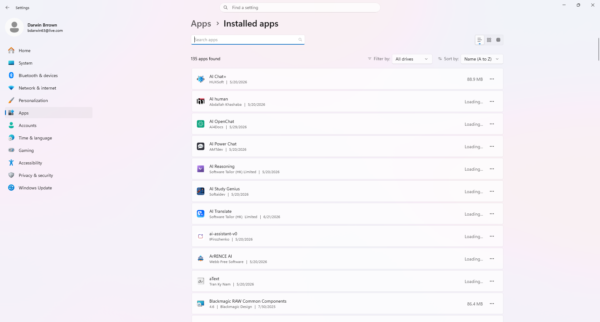
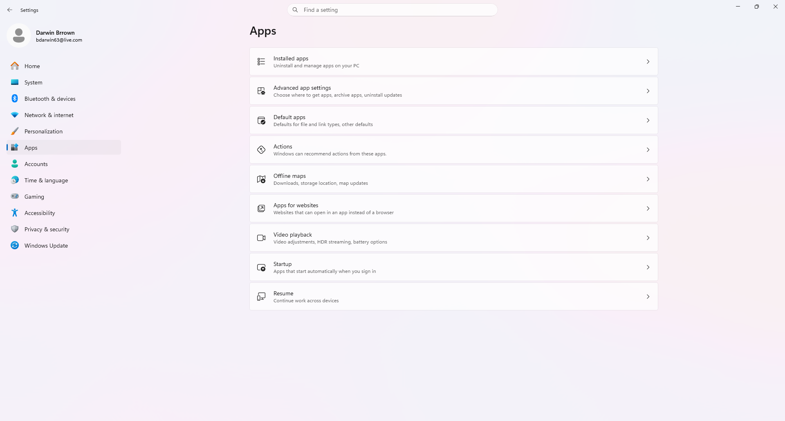
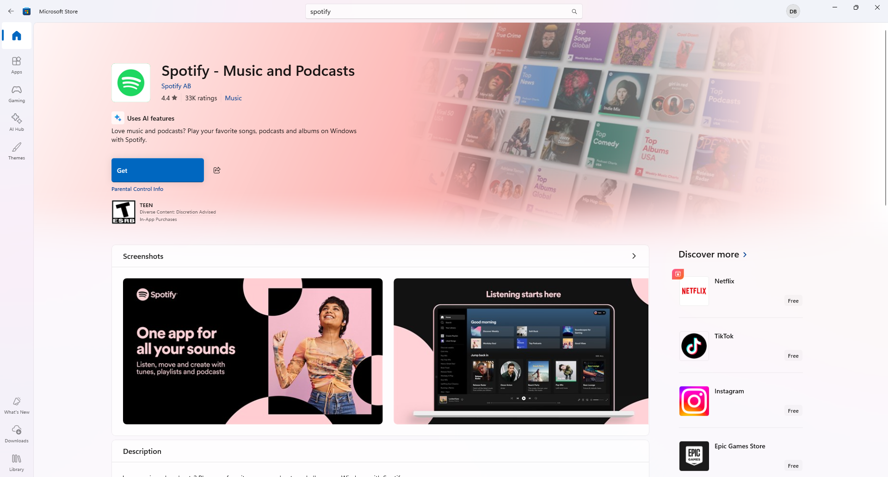
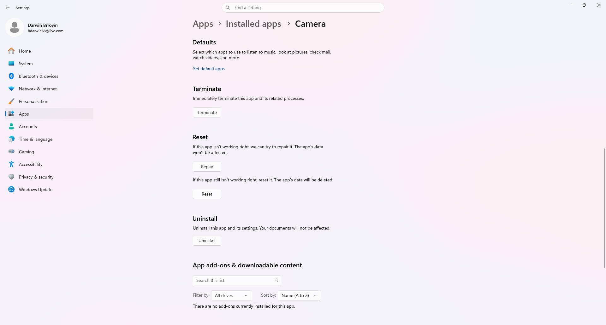
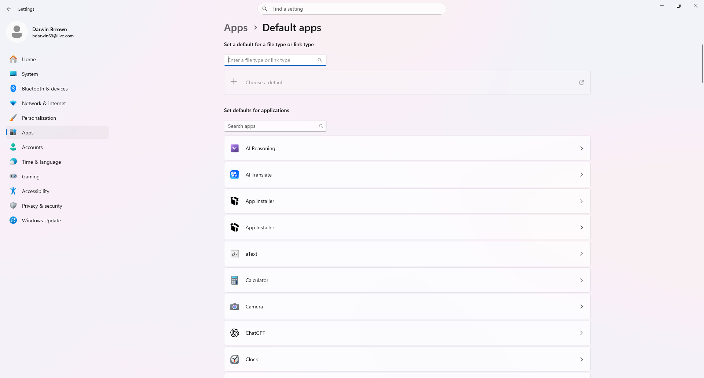
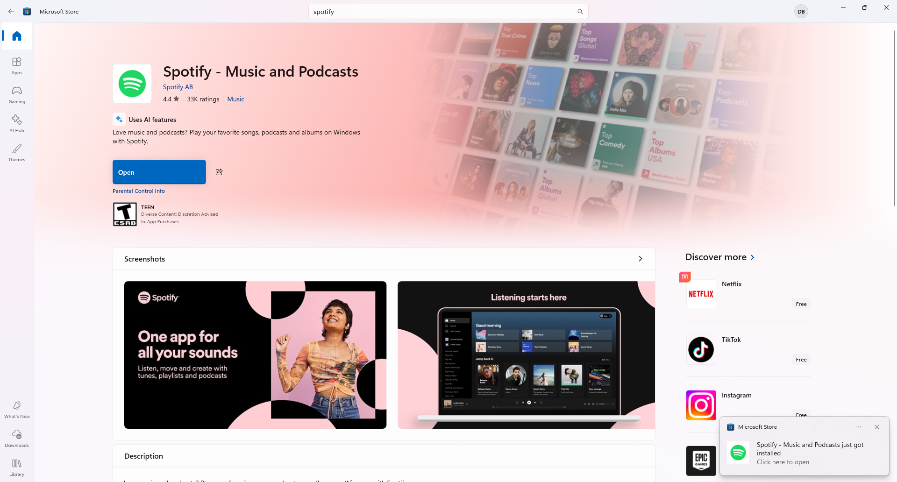
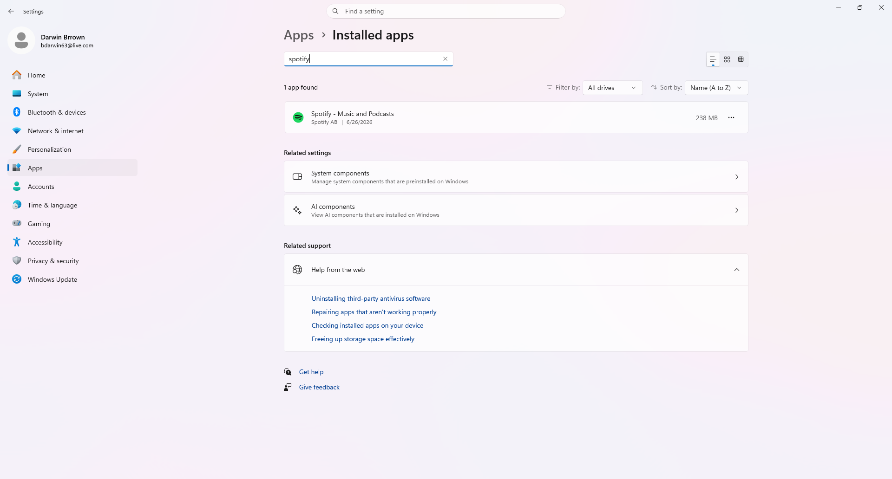
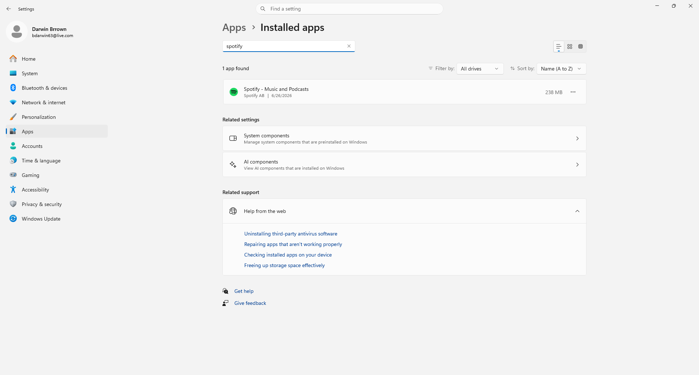

# Darwin Software Installation Troubleshooting Lab

## Overview

This project demonstrates a common Windows 11 Help Desk troubleshooting scenario involving software installation and application management.

The lab walks through locating installed applications, installing software from the Microsoft Store, verifying successful installation, reviewing application repair options, configuring default applications, and confirming the application is available to end users.

---

## Skills Demonstrated

- Windows 11 Administration
- Software Installation
- Microsoft Store Management
- Help Desk Troubleshooting
- Application Verification
- Application Repair
- Application Reset
- Default App Configuration
- Software Management
- Technical Documentation
- End-User Support

---

## Tools Used

- Windows 11
- Microsoft Store
- Windows Settings
- Installed Apps
- Default Apps
- Application Repair Settings

---

# Lab Walkthrough

## 1. Installed Applications

Opened Windows Installed Apps and reviewed currently installed software.

---

## 2. Apps Features

Reviewed Windows Apps settings and available application management features.

---

## 3. Install New Application

Installed Spotify from the Microsoft Store.

---

## 4. Application Repair Options

Reviewed the application's Repair, Reset, and Uninstall options.

---

## 5. Default Applications

Reviewed Windows Default Apps configuration.

---

## 6. Software Installed

Verified the application installed successfully and was ready to launch.

---

## 7. Installed App Verification

Verified Spotify appears in the Installed Apps list.

---

## 8. Project Complete

Completed the software installation troubleshooting lab.

---

# Tasks Completed

- ✅ Opened Installed Apps
- ✅ Reviewed Windows Apps settings
- ✅ Installed software from Microsoft Store
- ✅ Verified successful installation
- ✅ Reviewed application repair options
- ✅ Reviewed application reset options
- ✅ Reviewed default application settings
- ✅ Verified installed application
- ✅ Confirmed software launches successfully
- ✅ Documented troubleshooting steps

---

# Key Takeaways

- Learned common Windows software installation procedures.
- Installed applications using Microsoft Store.
- Verified successful software installation.
- Reviewed application repair and reset options.
- Configured and reviewed default application settings.
- Practiced Tier 1 Help Desk software troubleshooting.
- Improved Windows application management skills.

---

## Author

**Darwin Brown**
